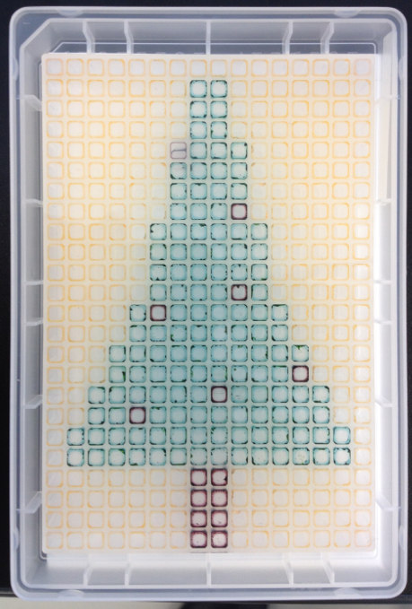

```{r, include = FALSE}
knitr::opts_chunk$set(
  collapse = TRUE,
  comment = "#>"
)
```

```{r setup}
library(topcorneR) |> suppressPackageStartupMessages()
```

Let's paint a Christmas tree in a 96-well plate by transferring colored inks!

## Result

We ran this transfer in February 2018 during a demo at RIKEN.



Let's see how it was prepared!

## Planning the result

First, let's create a `Plate` object that represents the expected result of
the transfer.

```{r make_plate}
planPlate <- Plate("384")
```

### Our tree has a stem, …

```{r add_stem}
planPlate <- set_block(planPlate, "H21~I24", "stem", 1000)
```

### … and green leaves …

```{r add_leaves}
planPlate <- planPlate |>
  set_block("B19~O20", "leaves", 1000) |>
  set_block("C17~N18", "leaves", 1000) |>
  set_block("D15~M16", "leaves", 1000) |>
  set_block("E13~L14", "leaves", 1000) |>
  set_block("F09~K12", "leaves", 1000) |>
  set_block("G05~J08", "leaves", 1000) |>
  set_block("H02~I04", "leaves", 1000)
```

### … and is decorated with balls.

```{r add_Xmas_balls}
planPlate <- planPlate |>
  set_block("G05", "balls", 1000) |>
  set_block("J08", "balls", 1000) |>
  set_block("F13", "balls", 1000) |>
  set_block("J12", "balls", 1000) |>
  set_block("I17", "balls", 1000) |>
  set_block("E18", "balls", 1000) |>
  set_block("M16", "balls", 1000)
```

### Let's visualise the `Plate` object

```{r plot_plate_by_part, fig.height=4, fig.width=6}
plateMap <- function(plate, x, title) {
  platetools::raw_map(plate[[x]], well=rownames(plate), plate="384") +
  ggplot2::ggtitle(title)
}
(plot_stem   <- plateMap(planPlate, "stem",   "stem"))
(plot_leaves <- plateMap(planPlate, "leaves", "leaves"))
(plot_balls  <- plateMap(planPlate, "balls",  "balls"))
```

```{r plot_all_parts, fig.height=4, fig.width=6}
plateMap_all <- function(plate) {
  x <- lapply(colnames(plate), function(x) ifelse(is.na(plate[,x]), "", x))
  names(x) <- colnames(plate)
  x <- as.data.frame(x)
  x <- apply( x, 1
            , function(x)
                if(all(x=="")) {
                  NA
                } else {
                  paste(unique(x[x!=""]), collapse=",")
                })
  platetools::raw_map(x, well=rownames(plate), plate="384")
}
plateMap_all(planPlate)
```

## Source plate layout

The ink will be transferred from a source plate in 384-well format.  There needs
more green ink for the leaves than red and brown ink for the balls and the stem,
so there will be more than one well containing green ink.

```{r sourcePlate, fig.height=4, fig.width=6}
colSums(as.data.frame(planPlate)[,c("stem", "leaves", "balls")], na.rm = TRUE)
sourcePlate <- Plate("384", deadVolume = 1e4, maxVolume = 1e5)
sourcePlate <- sourcePlate |>
  set_block(  "A01",   "stem",   20000) |>
  set_block("A02~A04", "leaves", 60000) |>
  set_block(  "A05",   "balls",  20000)
plateMap_all(sourcePlate)
```

## Plan the transfer

Next, let's plan the transfer!

```{r transfers}
destPlate   <- Plate("384", deadVolume = 1e4, maxVolume = 1e5)

echo <- planTransfers(sourcePlate, destPlate, planPlate)
echo
transfers <- showLogs(echo)
head(transfers)
## We can export the transfer log as a CSV file to be loaded in the Echo machine.
# write.table( transfers[,1:3], file = "Xmas.csv"
#            , quote = FALSE, row.names = FALSE, col.names = FALSE, sep = ",")
```
